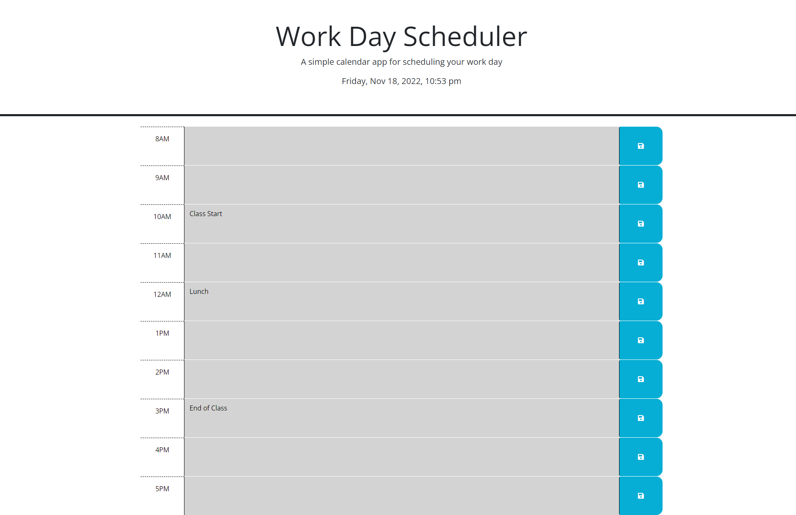

# Work Day Scheduler

## Description

A simple website that allows users to save events by hourly from 8AM to 5PM. The browser uses dayjs to log the time and the events that is saved are saved locally. As the time goes, each hour that passes, are greyed out, current hour will be red, and future hours are green.

## Screenshot


# User Story
```
- AS AN employee with a busy schedule
- I WANT to add important events to a daily planner
- SO THAT I can manage my time effectively
```

# Acceptance Criteria
```
GIVEN I am using a daily planner to create a schedule
WHEN I open the planner
THEN the current day is displayed at the top of the calendar
WHEN I scroll down
THEN I am presented with time blocks for standard business hours
WHEN I view the time blocks for that day
THEN each time block is color-coded to indicate whether it is in the past, present, or future
WHEN I click into a time block
THEN I can enter an event
WHEN I click the save button for that time block
THEN the text for that event is saved in local storage
WHEN I refresh the page
THEN the saved events persist
```

## Tech Used


## Link
<a href="https://connorcho66.github.io/work-day-scheduler/">Link to depoloyed website</a>

## License

N/A

## Contact

<ul>
    <li><b>Email: </b> <a href="connorcho22@gmail.com">connorcho22@gmail.com</a></li>
    <li><b>Github: </b> <a href="https://github.com/connorcho66">connorcho66</a></li>
    <li><b>Linked In: </b> <a href="www.linkedin.com/in/seongyun-cho-89a8a61a0">SeongYun Cho</a></li>
</ul>